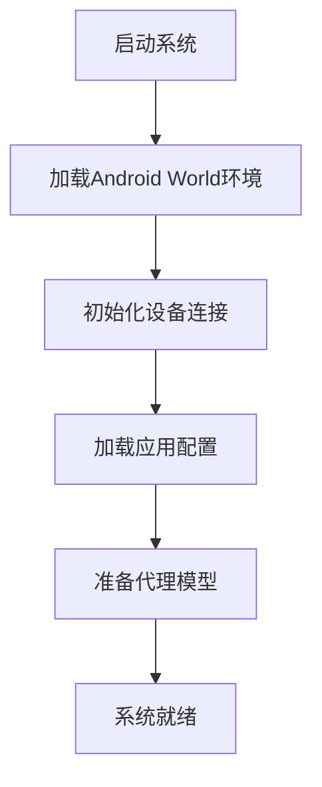
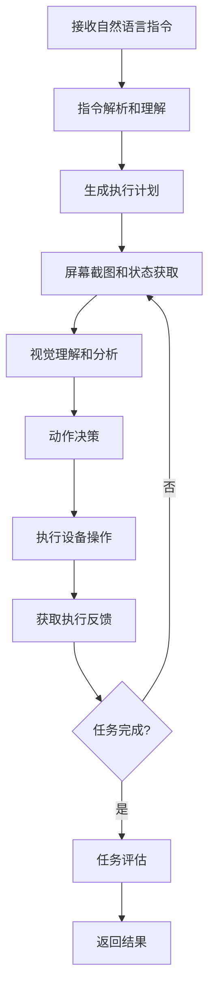

# Mobile-Agent-v3

Mobile-Agent-v3 是一个基于大语言模型的移动设备自动化代理系统，能够通过自然语言指令控制Android设备执行各种任务。

## 项目概述

Mobile-Agent-v3 是Mobile-Agent系列的第三代版本，集成了Android World环境，提供了更强大的移动设备自动化能力。该系统通过视觉理解、动作规划和执行反馈的闭环机制，实现了智能的移动应用操作。

## 项目结构

```
Mobile-Agent-v3/
├── android_world_v3/          # Android World环境核心模块
│   ├── android_world/         # Android环境抽象层
│   │   ├── env/              # 环境接口和实现
│   │   ├── task_evals/       # 任务评估模块
│   │   ├── agents/           # 各种代理实现
│   │   └── utils/            # 工具函数
│   ├── apps/                 # 支持的应用程序和Java组件
│   │   └── java/             # Java辅助工具和测试应用
│   ├── assets/               # 资源文件
│   ├── docker_setup/         # Docker环境配置
│   ├── docs/                 # 文档
│   ├── scripts/              # 脚本工具
│   ├── server/               # 服务器组件
│   ├── run_ma3.py            # 主要运行脚本
│   ├── minimal_task_runner.py # 最小任务运行器
│   ├── requirements.txt      # Python依赖
│   ├── setup.py              # 安装配置
│   ├── Dockerfile            # Docker镜像配置
│   └── pyproject.toml        # 项目配置
├── mobile_v3/                # Mobile Agent核心实现
│   ├── run_mobileagentv3.py  # 主运行脚本
│   └── utils/                # 工具函数
│       ├── call_mobile_agent_e.py  # LLM调用接口
│       ├── mobile_agent_e.py       # 核心代理实现
│       ├── controller.py           # 设备控制器
│       └── ...
├── cookbook/                 # 使用示例和工具
│   ├── end2end_usage.ipynb   # 端到端使用示例
│   └── utils/                # 辅助工具
└── assets/                   # 项目资源文件
```

## 核心组件

### 1. Android World环境 (android_world_v3/)

Android World是Mobile-Agent-v3的核心环境组件，提供了完整的Android自动化测试和评估框架。

#### 核心文件详解：

**主要运行脚本：**
- `run_ma3.py`: 主要的任务运行脚本，支持多种代理和任务配置
- `minimal_task_runner.py`: 最小化的任务运行器，用于快速测试
- `run_ma3.sh`: Shell脚本，用于批量运行任务
- `run_guiowl.sh`: GUI Owl代理的专用运行脚本

**环境配置：**
- `requirements.txt`: Python依赖包列表
- `setup.py`: 项目安装配置，包含protobuf编译逻辑
- `pyproject.toml`: 现代Python项目配置文件
- `Dockerfile`: Docker镜像构建配置
- `.pylintrc`: 代码质量检查配置

**核心模块 (android_world/)：**
- `env/`: 环境接口和实现
  - `interface.py`: 定义Android环境的抽象接口
  - `android_world_controller.py`: Android设备控制器实现
  - `adb_utils.py`: ADB工具函数
  - `actuation.py`: 设备操作执行器
  - `json_action.py`: JSON格式的动作定义
- `agents/`: 各种代理实现
  - `mobile_agent_v3.py`: Mobile Agent V3的主要实现
  - `gui_owl.py`: GUI Owl代理
  - `m3a.py`: M3A (Multimodal Autonomous Agent)
  - `seeact.py`: SeeAct代理
  - `t3a.py`: T3A (Text-only Autonomous Agent)
  - `base_agent.py`: 代理基类定义
- `task_evals/`: 任务评估系统
  - `single/`: 单应用任务评估
  - `composite/`: 复合任务评估
  - `information_retrieval/`: 信息检索任务
  - `miniwob/`: MiniWoB任务集成
- `utils/`: 工具函数库
- `registry.py`: 任务注册中心
- `episode_runner.py`: 任务执行管理器
- `suite_utils.py`: 测试套件工具
- `task_metadata.json`: 任务元数据配置

**应用和资源：**
- `apps/`: 支持的应用程序和Java组件
- `assets/`: 资源文件（图片、视频等）
- `docs/`: 文档目录
- `scripts/`: 辅助脚本
- `server/`: 服务器组件
- `docker_setup/`: Docker环境配置脚本

### 2. Mobile Agent核心 (mobile_v3/)

Mobile Agent的核心实现，提供了完整的移动设备自动化代理功能。

#### 核心文件详解：

**主要运行脚本：**
- `run_mobileagentv3.py`: Mobile Agent V3的主要运行入口，包含完整的任务执行逻辑

**工具模块 (utils/)：**
- `call_mobile_agent_e.py`: LLM调用接口，支持多模态模型调用
- `mobile_agent_e.py`: 核心代理实现，包含Manager、Executor、ActionReflector、Notetaker等组件
- `controller.py`: 设备控制器，处理ADB命令和设备操作
- `function_call_mobile_answer.py`: 函数调用和移动设备响应处理
- `new_json_action.py`: 新版JSON动作格式定义
- `schema.py`: 数据模式定义

### 3. 使用示例 (cookbook/)

提供了使用Mobile-Agent-v3的示例代码和工具：

- **示例脚本**: 展示如何使用系统的各种功能
- **工具函数**: 常用的辅助工具和配置

## 控制流程

### 1. 系统初始化



### 2. 任务执行流程



### 3. 核心工作原理

#### 感知层 (Perception)
- **屏幕理解**: 通过视觉模型分析当前屏幕内容
- **UI元素识别**: 识别可交互的UI组件
- **状态监控**: 监控应用和系统状态变化

#### 决策层 (Decision)
- **任务规划**: 将复杂任务分解为可执行的步骤
- **动作选择**: 基于当前状态选择最优动作
- **错误处理**: 处理执行过程中的异常情况

#### 执行层 (Action)
- **设备控制**: 执行点击、滑动、输入等操作
- **应用交互**: 与各种Android应用进行交互
- **反馈收集**: 收集执行结果和状态变化

## 主要特性

### 1. 多模态理解
- 结合视觉和文本信息进行决策
- 支持复杂的UI界面理解
- 自适应不同应用的界面布局

### 2. 智能规划
- 自动任务分解和步骤规划
- 动态调整执行策略
- 支持多步骤复杂任务

### 3. 鲁棒执行
- 错误检测和自动恢复
- 多种交互方式支持
- 适应性强的操作策略

### 4. 评估体系
- 自动化任务完成度评估
- 执行效率分析
- 错误类型统计和分析

## 技术架构

### 模型集成
- **视觉模型**: 用于屏幕内容理解和UI元素识别
- **语言模型**: 用于指令理解和动作规划
- **多模态融合**: 结合视觉和文本信息进行决策

### 环境接口
- **ADB接口**: 通过Android Debug Bridge控制设备
- **UI自动化**: 基于Android UI Automator的操作执行
- **屏幕捕获**: 实时获取设备屏幕状态

### 任务管理
- **任务队列**: 管理待执行的任务序列
- **状态跟踪**: 跟踪任务执行状态和进度
- **结果评估**: 自动评估任务执行效果

## 使用方法

### 环境准备

1. **Android设备配置**
   - 启用开发者选项和USB调试
   - 安装必要的应用程序
   - 确保ADB连接正常

2. **依赖安装**
   ```bash
   # 安装Python依赖
   pip install -r requirements.txt
   
   # 配置Android SDK
   export ANDROID_HOME=/path/to/android/sdk
   ```

3. **Docker环境** (可选)
   ```bash
   cd docker_setup
   docker-compose up -d
   ```

### 基本使用

```python
from mobile_v3.utils.call_mobile_agent_e import MobileAgentE

# 初始化代理
agent = MobileAgentE()

# 执行任务
result = agent.execute_task("打开微信并发送消息给张三")

# 查看结果
print(f"任务完成状态: {result.success}")
print(f"执行步骤: {result.steps}")
```

### 高级配置

```python
# 自定义配置
config = {
    "model_name": "gpt-4-vision",
    "max_steps": 20,
    "timeout": 300,
    "screenshot_interval": 1.0
}

agent = MobileAgentE(config=config)
```

## 支持的应用

Mobile-Agent-v3 通过Android World框架支持多种类型的Android应用：

### 系统应用
- **联系人 (Contacts)**: 联系人管理和操作
- **短信 (SMS)**: 短信发送和接收
- **电话 (Phone)**: 通话功能
- **时钟 (Clock)**: 闹钟和计时器
- **相机 (Camera)**: 拍照和录像
- **文件管理 (Files)**: 文件操作
- **系统设置 (System)**: 各种系统配置

### 第三方应用
- **Markor**: Markdown编辑器
- **Simple Gallery Pro**: 图片管理
- **VLC**: 媒体播放器
- **Retro Music**: 音乐播放器
- **Audio Recorder**: 录音应用
- **Simple Draw Pro**: 绘图应用
- **OsmAnd**: 地图导航
- **Recipe**: 食谱管理
- **Expense**: 费用管理
- **Joplin**: 笔记应用

### Java辅助组件

`apps/java/` 目录包含了Java编写的辅助工具和测试应用：

**作用和功能：**
1. **测试工具**: 用于验证Android World环境的功能
2. **辅助服务**: 提供特定的Android服务支持
3. **数据生成**: 生成测试数据和模拟用户行为
4. **接口桥接**: 在Java和Python之间提供通信桥梁

**编译和部署：**
- 使用Bazel构建系统进行编译 (MODULE.bazel配置)
- 可以编译成APK文件安装到Android设备
- 主要用于测试环境和开发调试
- 不是必需的用户应用，而是框架的辅助组件

这些Java组件通过Bazel构建系统管理，可以根据需要编译成Android应用安装到测试设备上，为Mobile-Agent-v3提供更完整的测试和开发环境支持。

## 性能优化

### 1. 执行效率
- 智能缓存机制减少重复操作
- 并行处理提高响应速度
- 自适应等待时间优化

### 2. 准确性提升
- 多轮验证确保操作正确性
- 上下文记忆避免重复错误
- 动态学习提升成功率

### 3. 资源管理
- 内存使用优化
- GPU资源合理分配
- 网络请求优化

## 扩展开发

### 添加新应用支持

1. 在 `apps/` 目录下创建应用配置文件
2. 定义应用特定的操作策略
3. 添加相应的测试用例

### 自定义任务评估

1. 继承基础评估类
2. 实现特定的评估逻辑
3. 注册到评估系统中

### 集成新模型

1. 实现模型接口
2. 添加配置选项
3. 更新调用逻辑

## 故障排除

### 常见问题

1. **设备连接失败**
   - 检查USB调试是否开启
   - 确认ADB驱动安装正确
   - 验证设备授权状态

2. **任务执行失败**
   - 检查应用是否已安装
   - 确认屏幕分辨率适配
   - 查看错误日志详情

3. **性能问题**
   - 调整截图频率
   - 优化模型推理参数
   - 检查系统资源使用

### 调试工具

- **日志系统**: 详细的执行日志记录
- **可视化工具**: 操作步骤可视化展示
- **性能监控**: 实时性能指标监控

## 贡献指南

欢迎为Mobile-Agent-v3项目贡献代码！请遵循以下步骤：

1. Fork项目仓库
2. 创建功能分支
3. 提交代码更改
4. 创建Pull Request

## 许可证

本项目采用 [MIT License](LICENSE) 开源许可证。

## 联系方式

如有问题或建议，请通过以下方式联系：

- 提交Issue到GitHub仓库
- 发送邮件到项目维护者
- 参与社区讨论

## 移植到Android 14+ Native Service指南

### 可参考的核心代码模块

如果要将Mobile-Agent-v3移植到Android 14+平台作为native service（C/C++）运行，以下目录和文件最具参考价值：

#### 1. 设备控制和交互层 (高优先级参考)

**核心文件：**
- `mobile_v3/utils/controller.py` - 设备控制逻辑，ADB命令封装
- `android_world_v3/android_world/env/adb_utils.py` - ADB工具函数和设备通信
- `android_world_v3/android_world/env/actuation.py` - 设备操作执行器（点击、滑动、输入）
- `android_world_v3/android_world/env/interface.py` - 环境接口定义和状态管理

**移植要点：**
- 将ADB命令转换为Android Framework API调用
- 使用InputManager、AccessibilityService、UiAutomation等系统服务
- 实现触摸事件注入和UI元素识别

#### 2. 动作定义和协议层 (高优先级参考)

**核心文件：**
- `android_world_v3/android_world/env/json_action.py` - JSON动作格式定义
- `mobile_v3/utils/new_json_action.py` - 新版动作格式
- `mobile_v3/utils/schema.py` - 数据模式定义

**移植要点：**
- 设计C++结构体对应Python数据类
- 实现JSON序列化/反序列化（推荐使用nlohmann/json）
- 定义标准化的动作协议

#### 3. UI元素识别和表示层 (中等优先级参考)

**核心文件：**
- `android_world_v3/android_world/env/representation_utils.py` - UI元素处理
- `android_world_v3/android_world/env/android_world_controller.py` - UI树信息处理

**移植要点：**
- 使用AccessibilityNodeInfo替代Python的UI树解析
- 实现高效的UI元素缓存和更新机制
- 考虑使用Android的ViewCapture API

#### 4. 代理架构和状态管理 (中等优先级参考)

**核心文件：**
- `android_world_v3/android_world/agents/base_agent.py` - 代理基类
- `mobile_v3/utils/mobile_agent_e.py` - 核心代理实现
- `android_world_v3/android_world/episode_runner.py` - 任务执行管理

**移植要点：**
- 设计C++类层次结构对应Python代理
- 实现状态机和任务执行流程
- 考虑多线程和异步处理

### 关键技术注意事项

#### 1. Android 14+ 系统适配

**权限和安全：**
- 需要系统级权限（INJECT_EVENTS, WRITE_SECURE_SETTINGS等）
- 考虑SELinux策略适配
- 可能需要签名为系统应用或获取特殊权限

**API变更：**
- Android 14引入了更严格的后台限制
- 需要适配新的隐私和安全政策
- 考虑使用Android 14的新API（如改进的AccessibilityService）

#### 2. Native Service架构设计

**服务注册：**
```cpp
// 示例：在init.rc中注册服务
service mobile_agent /system/bin/mobile_agent_service
    class main
    user system
    group system
    capabilities SYS_ADMIN
```

**IPC通信：**
- 使用Binder接口与应用层通信
- 考虑使用AIDL定义服务接口
- 实现异步回调机制

#### 3. 性能和资源优化

**内存管理：**
- 实现高效的UI树缓存策略
- 避免频繁的JNI调用
- 使用对象池减少内存分配

**实时性要求：**
- 优化UI元素识别算法
- 实现并行处理管道
- 考虑使用硬件加速

### 架构设计建议

#### 1. 分层架构设计

```
┌─────────────────────────────────────┐
│           应用层 (Java/Kotlin)        │
├─────────────────────────────────────┤
│        Android Framework API        │
│     (InputManager, AccessibilityService, etc.) │
├─────────────────────────────────────┤
│           JNI接口层                  │
├─────────────────────────────────────┤
│         C++ Native Service          │
│  ┌─────────────┬─────────────────┐   │
│  │  代理引擎    │   设备控制器     │   │
│  ├─────────────┼─────────────────┤   │
│  │  动作执行器  │   UI识别器      │   │
│  │             │  (含在线模型)    │   │
│  └─────────────┴─────────────────┘   │
├─────────────────────────────────────┤
│          Linux Kernel              │
│      (Input Subsystem, Binder)     │
└─────────────────────────────────────┘
```

**架构说明：**
- **Android Framework API层**: 基于Java的系统服务，提供InputManager、AccessibilityService等API
- **JNI接口层**: 连接Java Framework和C++ Native Service的桥梁  
- **C++ Native Service**: 核心业务逻辑，包含AI模型调用和设备控制
- **Linux Kernel**: 底层系统调用和硬件抽象

#### 2. 核心组件设计

**设备控制器 (DeviceController):**
```cpp
class DeviceController {
public:
    bool executeAction(const Action& action);
    UIState getCurrentState();
    bool injectTouchEvent(int x, int y);
    bool injectKeyEvent(int keyCode);
private:
    sp<IInputManager> inputManager_;
    sp<IAccessibilityManager> accessibilityManager_;
};
```

**代理引擎 (AgentEngine):**
```cpp
class AgentEngine {
public:
    void setTask(const std::string& task);
    ActionResult step();
    bool isTaskComplete();
private:
    std::unique_ptr<LLMInterface> llm_;
    std::unique_ptr<DeviceController> controller_;
    TaskState currentState_;
};
```

**UI识别器 (UIRecognizer):**
```cpp
class UIRecognizer {
public:
    std::vector<UIElement> extractElements(const UIState& state);
    UIElement findElementByText(const std::string& text);
    UIElement findElementByCoordinate(int x, int y);
    UIElement findElementByVisualFeature(const cv::Mat& screenshot, const std::string& description);
    
private:
    sp<IAccessibilityManager> accessibilityManager_;
    std::unique_ptr<OnlineModelAdapter> modelAdapter_;
};
```

**在线模型适配器 (OnlineModelAdapter):**
```cpp
class OnlineModelAdapter {
public:
    struct ModelResponse {
        std::vector<BoundingBox> detectedElements;
        std::vector<std::string> descriptions;
        float confidence;
    };
    
    ModelResponse callGUIOwl(const cv::Mat& screenshot, const std::string& query);
    ModelResponse callCustomModel(const std::string& modelEndpoint, const cv::Mat& image);
    
private:
    std::unique_ptr<HttpClient> httpClient_;
    std::unique_ptr<GrpcClient> grpcClient_;
    std::string guiOwlEndpoint_;
};
```

#### 3. 关键实现策略

**UI元素识别：**
- 使用AccessibilityNodeInfo遍历UI树
- 集成GUI-OWL等在线视觉模型进行智能识别
- 实现高效的元素匹配算法
- 支持多种定位策略（ID、文本、坐标、视觉特征等）
- 在线模型适配器设计（支持HTTP/gRPC调用）

**动作执行：**
- 封装InputManager进行事件注入
- 实现手势识别和复杂操作
- 支持动作序列和时序控制

**状态管理：**
- 实现状态快照和回滚机制
- 支持任务中断和恢复
- 提供调试和监控接口

#### 4. 开发和部署建议

**开发环境：**
- 使用Android NDK进行C++开发
- 集成AOSP构建系统
- 考虑使用CMake管理依赖
- 集成OpenCV用于图像处理
- 配置HTTP/gRPC客户端库

**在线模型集成：**
- **GUI-OWL模型部署**: 支持RESTful API或gRPC接口
- **模型服务发现**: 实现动态端点配置和负载均衡
- **缓存策略**: 本地缓存常用UI识别结果，减少网络调用
- **降级机制**: 在线模型不可用时回退到传统UI树解析

**测试策略：**
- 实现单元测试框架
- 支持模拟器和真机测试
- 提供性能基准测试
- 在线模型接口的Mock测试

**部署方案：**
- 编译为系统服务或特权应用
- 提供OTA更新机制
- 考虑模块化部署
- 支持在线模型服务的动态配置

### 潜在挑战和解决方案

#### 1. 权限和安全挑战
- **挑战**: Android 14+的严格权限控制
- **解决方案**: 申请系统级权限，考虑root方案或厂商定制

#### 2. 性能挑战
- **挑战**: 实时UI识别和动作执行，在线模型调用延迟
- **解决方案**: 
  - 优化算法，使用硬件加速，实现缓存机制
  - 异步模型调用，预测性UI识别
  - 本地轻量级模型与在线重型模型的混合策略

#### 3. 兼容性挑战
- **挑战**: 不同厂商的Android定制
- **解决方案**: 抽象化接口，支持多种实现方式

#### 4. 维护挑战
- **挑战**: C++代码的复杂性和维护成本
- **解决方案**: 良好的架构设计，完善的测试覆盖，详细的文档

这种移植需要深入的Android系统知识和大量的工程工作，但可以获得更好的性能和更深度的系统集成能力。

---

*Mobile-Agent-v3 - 让移动设备自动化变得简单智能*